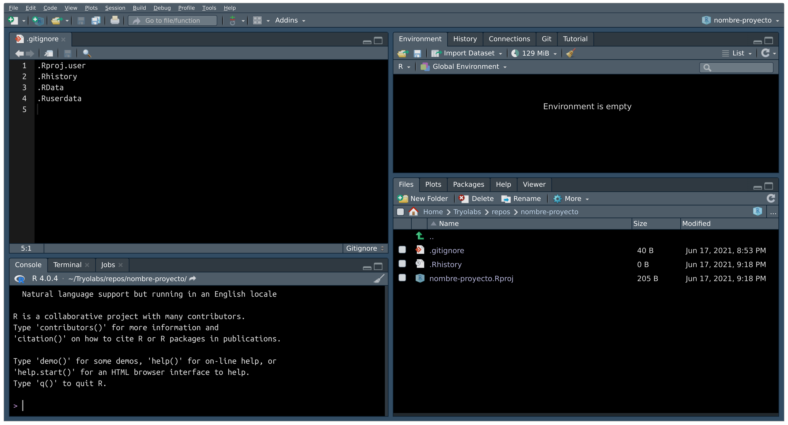

<style type="text/css">
.remark-slide-content {
    font-size: 30px;
}

.orange {
  color: #FF8A65;
  font-weight: bold;
}

.blue {
  color: #64B5F6;
  font-weight: bold;
}


</style>

```{r setup, include=FALSE}
options(htmltools.dir.version = FALSE)
```

# Presentación

.pull-left[
**Versionado de código y trabajo colaborativo**
- ¿Qué es `git`?
- ¿Cómo funciona?
- Ejemplo práctico con `git`
- ¿Qué es un repositorio remoto?
- Red social de programadores
- Ejemplo práctico con GitHub
]

.pull-right[
.center[]
]

---
# ¿Qué es git?

.pull-left[
- Herramienta para coordinar el desarrollo de código colaborativo
- Software para controlar versiones de archivos
- Creado por Linus Torvalds `r emo::ji('backhand_index_pointing_right_medium_dark_skin_tone')` para desarrollar el kernel Linux
- Es Software Libre, licencia GPLv2
]

.pull-right[
.center[]

.center[]
]

---
# git: ¿Cómo funciona?

.pull-left[
- Almacena estados o versiones de los archivos
- Los estados están unidos por una relación de parentesco
- Una serie de versiones es una rama o branch
- Modelo de Hash trees `r emo::ji('locked')`
]

.pull-right[
.center[]
]

---
# git: ¿Cómo funciona?

.pull-left[
- Cada nodo es un `commit`
- La serie .orange[naranja] representa la `branch main` o rama principal
- La serie .blue[azul] representa ramas para desarrollar una funcionalidad de nuestro programa
]

.pull-right[

]

---
# Ejemplo práctico con git

**Instalar `git`**

.pull-left[

```{bash, eval=FALSE}
# Debian-based distros
$ sudo apt install git

# Arch-based distros
$ sudo pacman -S git

# RHEL-based distros
$ sudo yum install git

# Open-SUSE
$ sudo zypper install git
```
]

.pull-right[
- MacOS
```sh
$ brew install git
```

- Microsoft Windows:
  - Descargar ejecutable desde sitio oficial:
  https://git-scm.com/download/win

]
---
# Ejemplo práctico con git

**Configurar git**

```{bash, eval=FALSE}
$ git config --global user.`name`  "Nina Miranda"
$ git config --global user.`email` "tucorazon@donato.com"
$ git config --global init.defaultBranch "main"
```

.pull-left[
**Crear carpeta para proyecto e inicializar git**
```{bash, eval=FALSE}
$ mkdir nombre-proyecto
$ cd nombre-proyecto
$ `git init`
```
]

.pull-right[
.center[<image src="images/git-folder.png" alt="git folder" width="40%" image/>]
]

---
# Ejemplo práctico con git

.pull-left[
**Crear proyecto en RStudio**

- Archivo > Nuevo Proyecto...
  - Directorio Existente > Crear Proyecto


- Creación automática de:
  - *nombre-proyecto.Rproj*
  - *.gitignore*
]

.pull-right[
.center[]
El archivo **_.gitignore_** sirve para definir todo lo que **no** queremos versionar
]

---
# Ejemplo práctico con git

.pull-left[
**Agregar README desde RStudio**

- Archivo > Nuevo Archivo
  - Markdown File
- El archivo **_README.md_** va a ser la carátula de nuestro proyecto
- Contenido del archivo en formato Markdown `r emo::ji('backhand_index_pointing_down_medium_dark_skin_tone')`

```sh
# Nombre de proyecto
```
]

.pull-right[.center[]]


---
# Ejemplo práctico con git

**Estados de los archivos**

.center[]

---
# Ejemplo práctico con git

**git status** - Ver estado del árbol de trabajo

```{bash, eval=FALSE}
$ `git status`

On branch `main`

No commits yet

Untracked files:
  (use "git add <file>..." to include in what will be committed)
        .gitignore
        README.md
        nombre-proyecto.Rproj
```

---
# Ejemplo práctico con git

**git add** - Agregar contenido de archivos al índice

```{bash, eval=FALSE}
$ `git add` .gitignore README.md nombre-proyecto.Rproj
$ git status

On branch main

No commits yet

Changes to be committed:
  (use "git rm --cached <file>..." to unstage)
        new file:   .gitignore
        new file:   README.md
        new file:   nombre-proyecto.Rproj
```

---
# Ejemplo práctico con git

**git commit** - Grabar cambios al repositorio

```{bash, eval=FALSE}
$ `git commit` -m "first commit"
[main (root-commit) 42ca9c7] first commit
3 files changed, 18 insertions(+)
 create mode 100644 .gitignore
 create mode 100644 README.md
 create mode 100644 nombre-proyecto.Rproj

$ git status
On branch main
nothing to commit, working tree clean
```

---
# Ejemplo práctico con git

**git branch** - Listar, crear, o borrar ramas

- Creamos una **branch** por funcionalidad a desarrollar

.pull-left[
```{bash, eval=FALSE}
$ `git branch` load-data
$ git branch --list
  load-data
`*` main
```

- La rama .orange[naranja] es `main`
- La rama .blue[azul] es `load-data`
]

.pull-right[.center[]]

---
# Ejemplo práctico con git

**git checkout** - Cambiar de rama

.pull-left[
```{bash, eval=FALSE}
$ `git checkout` load-data
Switched to branch 'load-data'
```

- La rama .orange[naranja] es `main`
- La rama .blue[azul] es `load-data`
]

.pull-right[.center[]]

---
# Ejemplo práctico con git

.pull-left[
**Desarrollar en rama .blue[load-data]**

- Agregar un Rscript para cargar datos
  - Archivo > Nuevo Archivo > R Script
- Crear carpeta **R/** para alojar código
- Crear carpeta **data/** para alojar datos
]

.pull-right[]

---
# Ejemplo práctico con git

**Miramos el estado del árbol de trabajo**

```{bash, eval=FALSE}
$ git status
On branch load-data
Untracked files:
  (use "git add <file>..." to include in what will be committed)
        R/
        data/
```

--
.center[**¿Versionamos los datos?**]
.center[`r emo::ji('thinking')`]

---
# Ejemplo práctico con git

**Uso de .gitignore**

.pull-left[
- Agregamos la carpeta **data**
]
.pull-right[]

---
# Ejemplo práctico con git

**Miramos el estado del árbol de trabajo**

```{bash, eval=FALSE}
$ git status
On branch load-data
Changes not staged for commit:
  (use "git add <file>..." to update what will be committed)
  (use "git restore <file>..." to discard changes in working directory)
        modified:   .gitignore

Untracked files:
  (use "git add <file>..." to include in what will be committed)
        R/
```

---
# Ejemplo práctico con git

**Agregar contenido + grabar cambios**

```{bash, eval=FALSE}
$ `git add` R/ .gitignore
$ git status
On branch load-data
Changes to be committed:
  (use "git restore --staged <file>..." to unstage)
        modified:   .gitignore
        new file:   R/load_data.R

$ `git commit` -m "load data pipeline"
[load-data 4ba3a2f] load data pipeline
 2 files changed, 8 insertions(+)
 create mode 100644 R/load_data.R
```

---
# Ejemplo práctico con git

**Seguimos el desarrollo en rama .blue[load-data]**

.pull-left[
- Agregamos un filtro a los datos
]

.pull-right[]

---
# Ejemplo práctico con git

**git diff** - Ver cambios entre commits

.pull-left[

```{bash, eval=FALSE}
$ git diff
```


]

---
# Ejemplo práctico con git

**Repetimos proceso:**

.pull-left[

```{bash, eval=FALSE}
$ git add R/load_data.R
$ git commit -m "Filter to var1"
[load-data 68607e9] Filter to var1
 1 file changed, 5 insertions(+)
```
]

.pull-right[.center[]]

---
# ¿Qué es un repositorio remoto?

.pull-left[
- Un espacio en un servidor (por lo general de otra persona)
- Podemos alojar nuestro código y utilizar el control de versiones `git`
- Algunas plataformas: GitHub, GitLab, Bitbucket

.center[]
]

.pull-right[.center[]]


---
# Red social de programadores

.pull-left[
.center[]
]

.pull-right[
.center[]
]

---
# Ejemplo práctico con GitHub

- En la carpeta de nuestro proyecto:
```{bash, eval=FALSE}
$ git checkout main
$ git remote add origin https://github.com/ninamiranda/nombre-proyecto.git
$ git branch -M main
$ `git push` -u origin main
```

.center[]

---
# Ejemplo práctico con GitHub

**git push** - Actualiza el repositorio remoto

- Volvemos al desarrollo en rama .blue[load-data]

```{bash, eval=FALSE}
$ git checkout load-data
$ `git push`
fatal: The current branch load-data has no upstream branch.
To push the current branch and set the remote as upstream, use

    git push --set-upstream origin load-data
```

---
# Ejemplo práctico con GitHub

```{bash, eval=FALSE}
$ `git push --set-upstream origin load-data`
Enumerating objects: 11, done.
Counting objects: 100% (11/11), done.
Delta compression using up to 8 threads
Compressing objects: 100% (6/6), done.
Writing objects: 100% (9/9), 967 bytes | 483.00 KiB/s, done.
Total 9 (delta 1), reused 0 (delta 0), pack-reused 0
remote: Resolving deltas: 100% (1/1), done.
remote: 
remote: Create a pull request for 'load-data' on GitHub by visiting:
remote:      https://github.com/guzmanlopez/test-media/pull/new/load-data
remote: 
To github.com:guzmanlopez/test-media.git
 * [new branch]      load-data -> load-data
Branch 'load-data' set up to track remote branch 'load-data' from 'origin'.
```

---
# Ejemplo práctico con GitHub

**Pull Request**

.pull-left[
.center[]
]

.pull-right[
.center[]
]

---
# Ejemplo práctico con GitHub

**Merge pull request**

.pull-left[
.center[]
]

.pull-right[
.center[]
]

---
# Ciclo finalizado

.orange[main] > .blue[feature/branch ]> .blue[commit 1] > .blue[...] > .blue[commit n] > .blue[merge] > .orange[main]

.center[]